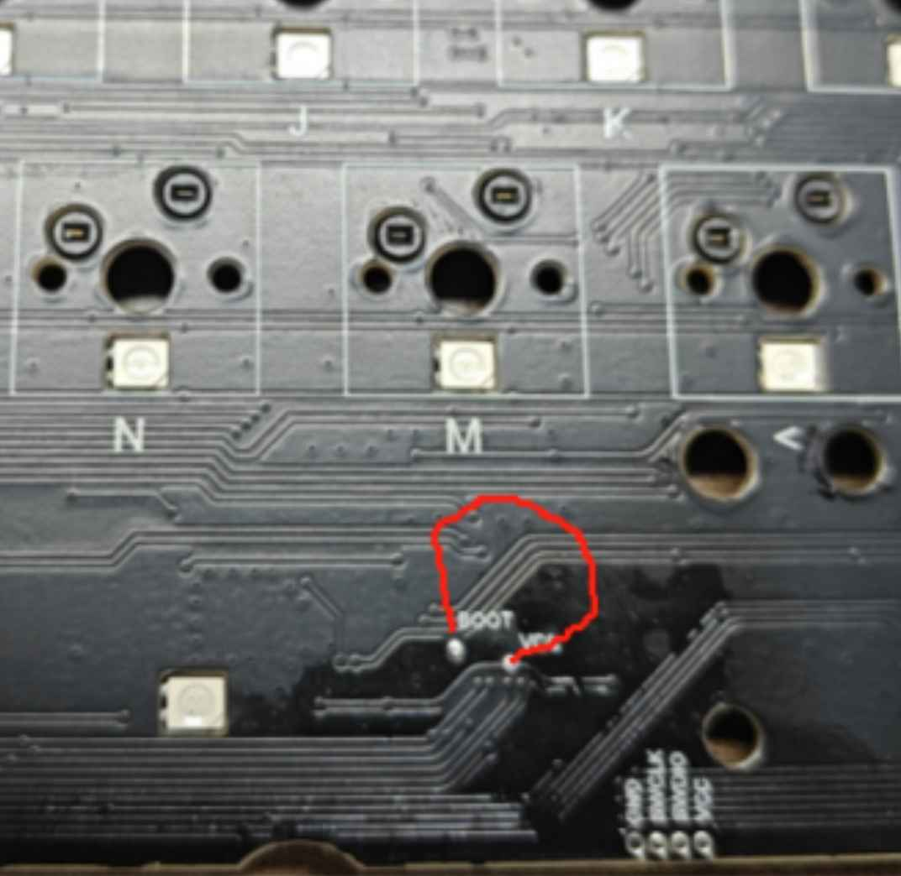

# Personal Keymap + Notes for Monsgeek M1W VIA

## Additional Software Required for Flashing

The Nix shell environment is missing [`wb32-dfu-updater`](https://github.com/WestberryTech/wb32-dfu-updater), which is used to update the firmware while the keyboard's MCU is in DFU mode.

On Fedora, [this COPR repository](https://copr.fedorainfracloud.org/coprs/erovia/wb32-dfu-updater/) contains a build that can be used:

```bash
sudo dnf copr enable erovia/wb32-dfu-updater
sudo dnf install wb32-dfu-updater
```

## Changes to Default Keymap

- `F13`: `PrtScr`
- Keys below the knob are remapped (top to bottom):
  - Insert
  - Delete
  - Home
  - End
- `Fn + Esc`: Reset to Bootloader
- `Fn + N`: Toggle NKRO
- `Fn + Win`: Lock Windows Key
- `Fn + LCtrl`: Unlock Windows Key
- `Fn + Tab`: Toggle NumLock
- Virtual Numpad - use `Fn` + one of the keys below:

```
+------+------+------+         +------+------+------+
| Q    | W    | E    |         | 7    | 8    | 9    |
+------+------+------+         +------+------+------+
| A    | S    | D    |         | 4    | 5    | 6    |
+------+------+------+  ---->  +------+------+------+
| Z    | X    | C    |         | 1    | 2    | 3    |
+------+------+------+         +------+------+------+
| LAlt |      |      |         | 0    |      |      |
+------+------+------+         +------+------+------+
```

## Changes to `config.h`

- Increase polling rate to 1000 Hz
- Turn off RGB lights when host is inactive

## Changes to `rules.mk`

- Enable bootmagic (using default `(0, 0)` position - `Esc`)
- Enable LTO for smaller firmware sizes
- Enable VIA
- Use asymmetric, deferred, per-key debounce algorithm

## Resetting to Bootloader

To reach the bootloader, use one of the following methods:

- Re-plug the device while holding `Esc`
- While the device is plugged in, press `Fn` + `Esc`

If neither of these work, it may be possible to reset to the bootloader using two pins on the PCB's front side ([source](https://discord.com/channels/1041956444913795132/1042017524801355808/1306191555648028713)). This is necessary if incorrect / incomplete firmware was flashed.



- Remove keycaps and switches
- Disassemble the keyboard case
- Unplug the USB Type-C daughterboard and battery
- Unscrew the PCB from the plate
- Plug in the USB Type-C daughterboard cable
- While using tweezers to short the `BOOT` and `VCC` pin, plug in the USB Type-C cable into your PC
