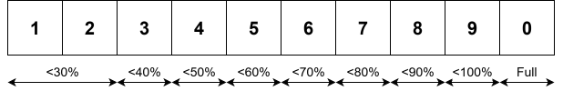

# Official VIA Firmware

Although custom firmware can be used for the M1W, the keyboard won't be usable in wireless mode. I couldn't figure out how to get it working...

## Flashing Firmware

Source: [How to Recover an M1W VIA Keyboard After Flashing M1 V1 QMK Firmware or Other Wrong Firmware?](https://www.monsgeek.com/faq/how-to-recover-an-m1w-via-keyboard-after-flashing-m1-qmk-firmware-or-other-wrong-firmware/)

- **Change Keyboard DIP Switch to Middle Position (Windows + Battery Disabled)**
  - DIP switch is under the `Caps Lock` key
- **Enter Bootloader Mode**
  - [For my custom keymap](../keymaps/ace4896), plug in the keyboard while holding `Esc`
  - For any firmware using VIA, assign a key to `Special -> Reset` and press this key
- **Flash in QMK Toolbox**
  - Flash [`m1w_20240602_v23.2.hex`](./m1w_20240602_v23.2.hex)
  - Exit DFU from QMK Toolbox

## VIA Configuration

Source: [How to connect M1W VIA version to VIA?](https://www.monsgeek.com/faq/how-to-connect-m1w-via-version-to-via/)

The M1W isn't in VIA's main repository - have to load a draft definition in the design tab. VIA also only works when in wired mode.

- **Change to Wired Mode + Connect via USB Cable**
- **Open [VIA](https://usevia.app/)**
- **Enable Design Mode**
  - Settings -\> Show Design tab: Enabled
- **Load VIA Layout Definition**
  - Load Draft Definition: [`M1W_V3_VIA_V3_Updated.json`](../via-definitions/M1W_V3_VIA_V3_Updated.json)

VIA doesn't always detect the keyboard on the first attempt - may need to relaunch VIA or remove + re-add the layout definition.

## Personal Layout

In my personal layout, I removed several keycodes I don't need and undocumented custom keycodes that VIA displayed.

- **Standard Keys**
  - Scroll Lock: `Fn + F11`
  - Pause: `Fn + F12`
  - Page Up: `Fn + Home`
  - Page Down: `Fn + End`
- **Connection Mode**
  - Bluetooth Device 1: `Fn + E`
  - Bluetooth Device 2: `Fn + R`
  - Bluetooth Device 3: `Fn + T`
  - 2.4 GHz Wireless: `Fn + Y`
  - Wired: `Fn + U`
- **RGB Settings**
  - Turn LEDs On/Off: `Fn + L`
  - Cycle Effects: `Fn + \`
  - Change Brightness: `Fn + Down` / `Fn + Up`
  - Change Saturation: `Fn + Left` / `Fn + Right`
  - Change Effect Speed: `Fn + -` / `Fn + =`
- **Misc.**
  - Enter Bootloader: `Fn + Reset`
  - Clear EEPROM: `Fn + ~` (hold for 5 seconds)
  - Check Battery Level: `Fn + Space` (wireless mode only)
  - Change Display Brightness: `Fn + Rotate Knob`
  - Toggle Windows Key Lock: `Fn + Win`
  - Toggle NKRO: `Fn + N`

## Wireless-Specific Details

To pair bluetooth or 2.4 GHz wireless:

- Hold the corresponding connection mode keys for 3 seconds
  - Indicator LED should begin to flash
- Pair the device:
  - For bluetooth, pair within OS settings
  - For 2.4 GHz wireless, plug in the wireless receiver

When holding `Fn + Space`, the number row LEDs will change colour. The number of red/green LEDs indicates the battery level:

